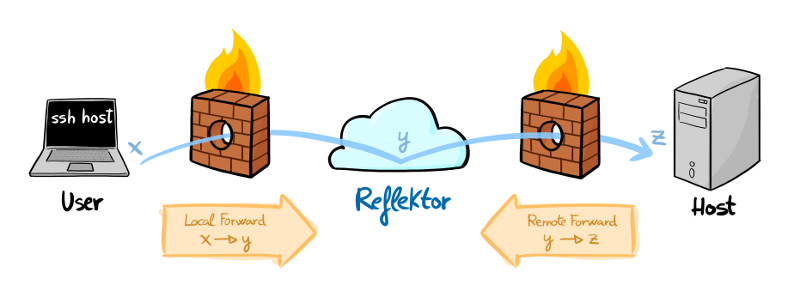

reflektor
=========

A proxy for remote forwards

1. Host connects to Reflektor with `ssh -o 'RemoteForward
   localhost:y:localhost:z'`
2. User gains local access to tcp ports on Host with `ssh -o 'LocalForward
   localhost:x:localhost:y'`
3. or, assuming _z_ is the port where sshd is listening on Host, User connects
   to sshd running on Host with `ssh -o 'ProxyCommand ssh -W localhost:y
   user@reflektor'`

What is reflektor?
------------------

reflektor is a methodology to configure an OpenSSH server that grants access to
services published by remote hosts, where only authorized users can access
remote forwards, and only authorized hosts can create remote forwards.

What can I do with reflektor?
-----------------------------

* Expose any tcp service behind a NAT or firewall to authorized users

What is reflektor useful for?
-----------------------------

* Adding public key authentication to any tcp service
* Running networked services on hosts that are firewalled off from the internet
